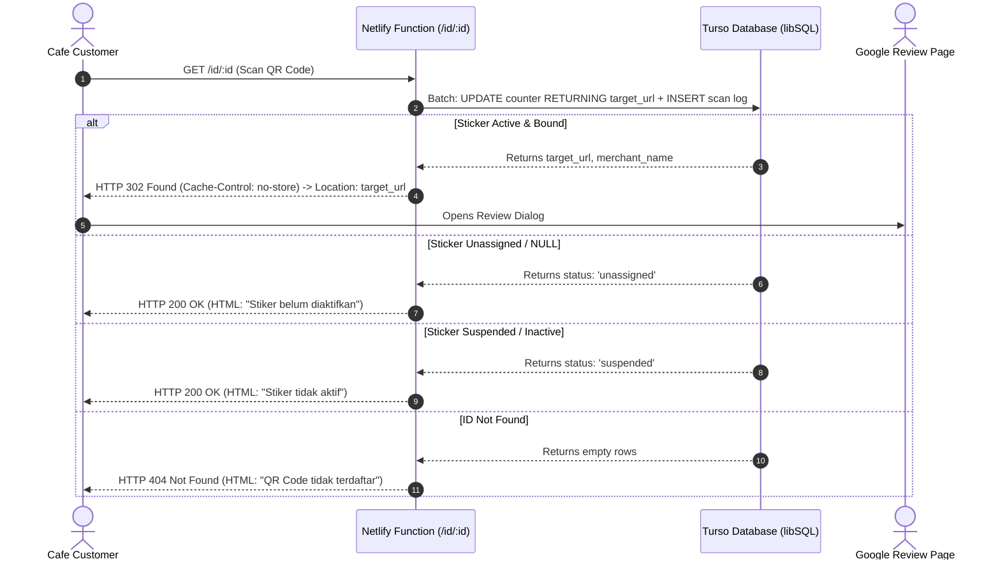

# AGENTS.md — Netlify Redirect & Tracking Engine (`greview-qr`)

## 1. Overview & System Purpose

This repository (`google-review-qr-netlify`) hosts the serverless redirect and telemetry microservice for the **Google Review QR Code Sticker** product line.

Physical vinyl stickers with pre-printed unique QR codes are deployed across restaurant tables and cashier counters. Each sticker contains a unique URL endpoint:
```text
https://greview-qr.netlify.app/id/:id
```

### Core Responsibilities
- **High-Speed Edge Redirect:** Resolves the unique sticker `:id` against the Turso database and redirects the customer to the merchant Google Review URL with minimal latency (<300ms).
- **Rudimentary Scan Tracking:** Atomically increments total scan count and records basic access logs (timestamp, IP, user-agent, referer).
- **Graceful Fallback Handling:** Renders branded fallback web pages if an ID is unassigned, inactive, suspended, or invalid.
- **Strict Separation of Concerns:** Netlify performs read-heavy edge redirection and scan logging only. Linking, merchant onboarding, and URL management are handled by an external system directly on the Turso database.

---

## 2. Architecture & Operational Model

### Business Context: Pre-Printed Just-In-Time Pairing
Stickers are mass-produced in advance with sequential or hashed IDs before merchants are acquired. Sales representatives carry pre-printed stickers directly to client locations. Upon closing a deal:
1. Stickers are physically affixed immediately.
2. The representative binds the sticker `:id` to the merchant Google Review URL via a separate management interface.
3. No reprinting or custom manufacturing delay occurs.

### System Workflow



---

## 3. Database Specification (Turso / libSQL SQLite)

Connection protocol must use `libsql://` or `https://` via `@libsql/client`.

### Schema Definition

```sql
-- Master Table: QR Link Registry
CREATE TABLE IF NOT EXISTS qr_links (
    id TEXT PRIMARY KEY,
    batch_no TEXT,
    merchant_name TEXT,
    target_url TEXT,
    scan_count INTEGER DEFAULT 0,
    status TEXT DEFAULT 'unassigned', -- 'unassigned' | 'active' | 'suspended'
    created_at DATETIME DEFAULT CURRENT_TIMESTAMP,
    assigned_at DATETIME,
    last_scanned_at DATETIME
);

-- Telemetry Table: Audit Scan Logs
CREATE TABLE IF NOT EXISTS qr_scans (
    id INTEGER PRIMARY KEY AUTOINCREMENT,
    link_id TEXT NOT NULL,
    scanned_at DATETIME DEFAULT CURRENT_TIMESTAMP,
    ip TEXT,
    city TEXT,
    country TEXT,
    user_agent TEXT,
    referer TEXT,
    FOREIGN KEY (link_id) REFERENCES qr_links(id)
);

-- Indexes for Fast Lookup
CREATE INDEX IF NOT EXISTS idx_qr_links_status ON qr_links(status);
CREATE INDEX IF NOT EXISTS idx_qr_scans_link_id ON qr_scans(link_id);
CREATE INDEX IF NOT EXISTS idx_qr_scans_scanned_at ON qr_scans(scanned_at);
```

### Atomic Query Pattern (Single Round-Trip Execution)
To eliminate latency, avoid sequential `SELECT` then `UPDATE`. Use libSQL `batch` execution with SQLite `RETURNING`:

```typescript
const [updateResult, _logResult] = await db.batch([
  {
    sql: `UPDATE qr_links 
          SET scan_count = scan_count + 1, last_scanned_at = CURRENT_TIMESTAMP 
          WHERE id = ? AND status = 'active' AND target_url IS NOT NULL 
          RETURNING target_url, merchant_name;`,
    args: [id],
  },
  {
    sql: `INSERT INTO qr_scans (link_id, ip, city, country, user_agent, referer) 
          VALUES (?, ?, ?, ?, ?, ?);`,
    args: [id, clientIp, city, country, userAgent, referer],
  }
]);
```

---

## 4. Netlify Functions Implementation Specification

### Runtime & Configuration
- **API Version:** Netlify Functions v2 (Native Web `Request` and `Response` interfaces).
- **Route Binding:** Dynamic route export:
  ```typescript
  import type { Config, Context } from "@netlify/functions";
  
  export const config: Config = {
    path: "/id/:id",
  };
  ```

### HTTP Response Requirements

| Scenario | HTTP Status | Headers | Body Content |
| :--- | :--- | :--- | :--- |
| Active redirect | `302 Found` | `Location: <target_url>`<br>`Cache-Control: no-store, no-cache, must-revalidate` | Empty |
| Unassigned sticker | `200 OK` | `Content-Type: text/html; charset=utf-8` | Branded HTML: Sticker not yet bound to merchant |
| Suspended sticker | `200 OK` | `Content-Type: text/html; charset=utf-8` | Branded HTML: Sticker disabled |
| Unknown ID | `404 Not Found` | `Content-Type: text/html; charset=utf-8` | Branded HTML: Invalid QR code |

*Important:* Never use `301 Moved Permanently`. Mobile browsers (Chrome and Safari) cache 301 responses locally, preventing subsequent scans from reaching Netlify and corrupting analytics telemetry.

---

## 5. Deployment & Configuration Details

### Netlify Site Metadata
- **Project Name:** `greview-qr`
- **Site ID:** `741be2d8-7511-4205-9610-b7588d5afda1`
- **Production URL:** `https://greview-qr.netlify.app`
- **Git Remote:** `https://github.com/PramaAditya/google-review-qr-netlify.git`

### Required Environment Variables
Must be configured both in local `.env` and via Netlify CLI (`netlify env:set <KEY> <VALUE>`):

| Key | Example Value | Description |
| :--- | :--- | :--- |
| `TURSO_DATABASE_URL` | `libsql://google-review-rekapancatama.aws-ap-south-1.turso.io` | libSQL Turso endpoint. Must use `libsql://` or `https://` scheme. |
| `TURSO_AUTH_TOKEN` | `eyJhbGci...` | Turso database authentication JWT token. |

---

## 6. Pending Tasks for New Session

The following items are identified and ready for immediate implementation in the next session:

1. **Fix `.env` URL Scheme:**
   Update `TURSO_DATABASE_URL` from `turso://` to `libsql://`.
2. **Create `package.json` in `netlify/`:**
   Configure dependencies `@libsql/client` and `@netlify/functions`, plus TypeScript dev dependencies.
3. **Update `.gitignore`:**
   Add `node_modules` to `netlify/.gitignore`.
4. **Normalize `netlify.toml`:**
   Set `functions = "functions"` and `publish = "public"`.
5. **Sync Cloud Environment Variables:**
   Push credentials to Netlify via `netlify env:set`.
6. **Execute Database Migration:**
   Run script to create `qr_links` and `qr_scans` tables in Turso.
7. **Write Function Handlers:**
   Implement `functions/redirect.ts` with atomic batch updates and HTML fallback templates.
